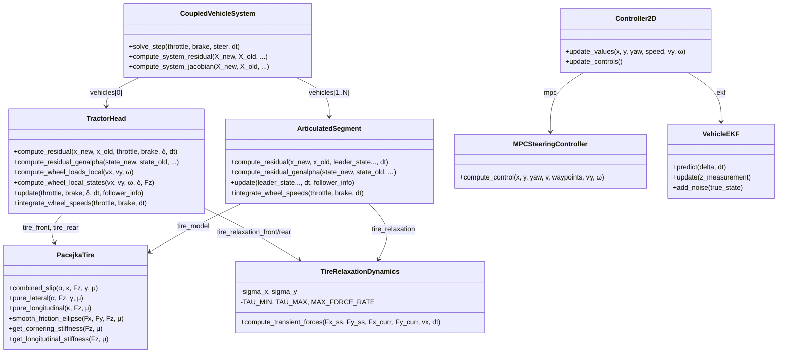

# `main.py` — Articulated Heavy Vehicle Dynamics Simulator

> **Full multi-body, nonlinear simulation** of a tractor + dolly + double-trailer combination with real-time path tracking, advanced tire models, and active safety systems.

---

## Table of Contents

1. [Overview](#1-overview)
2. [Architecture & Data Flow](#2-architecture--data-flow)
3. [Global Configuration Flags](#3-global-configuration-flags)
4. [Tire Modeling](#4-tire-modeling)
5. [Vehicle Bodies](#5-vehicle-bodies)
6. [Hitch Coupling & Articulation](#6-hitch-coupling--articulation)
7. [Time Integration & Solvers](#7-time-integration--solvers)
8. [Active Safety Systems](#8-active-safety-systems)
9. [Steering & Speed Control](#9-steering--speed-control)
10. [Suspension & Vertical Dynamics](#10-suspension--vertical-dynamics)
11. [Simulation Main Loop](#11-simulation-main-loop)
12. [Output & Data Export](#12-output--data-export)
13. [Key Equations Reference](#13-key-equations-reference)

---

## 1. Overview

`main.py` simulates a **tractor-dolly-semitrailer** articulated vehicle (A-double configuration) navigating a 3-D waypoint track. The simulation is physics-first: every timestep solves a fully-implicit system of coupled nonlinear equations for all vehicle units simultaneously.

### Vehicle Configuration

```
┌─────────────┐      ┌───────────┐      ┌─────────────┐      ┌─────────────┐
│  TractorHead │──────│  Trailer1 │──────│    Dolly     │──────│  Trailer2   │
│  (Leader)    │ 5th  │ (Semi)    │hitch │ (Converter)  │hitch │ (Semi)      │
│  Driven rear │wheel │ Rear only │joint │ Front+Rear   │joint │ Rear only   │
└─────────────┘      └───────────┘      └─────────────┘      └─────────────┘
     Steered               No steer          Front steered        No steer
     2 front + 4 rear      4 rear            2+4                  4 rear
```

### Key Features

| Feature | Description |
|---|---|
| **Tire model** | Pacejka Magic Formula with combined slip, camber thrust, friction ellipse |
| **Tire dynamics** | First-order relaxation length model (transient force build-up) |
| **Solver** | Generalized-α (2nd order) or Backward Euler (1st order), Newton-Raphson |
| **Coupling** | Implicit penalty-spring hitch constraints + rotational spring-damper |
| **Safety** | ABS, TCS, ESC, RSC (Roll Stability Control), pneumatic brake delay |
| **Control** | MPC steering + PID speed controller + EKF state estimator |
| **Vertical** | Quarter-car suspension per corner, roll/pitch dynamics |
| **Environment** | Variable μ-map, hydroplaning, 3-D terrain with pitch/grade |
| **Drivetrain** | 12-speed gearbox, torque converter, limited-slip differential |

---

## 2. Architecture & Data Flow

### Class Hierarchy



### Per-Timestep Data Flow

```
1. Controller2D.update_controls()
   ├── EKF: predict → sensor noise → update → filtered state
   ├── MPC: predict trajectory → optimize → δ_optimal
   └── PID: speed error → throttle/brake

2. TractorHead.update(throttle, brake, δ, dt)
   ├── integrate_wheel_speeds() [explicit, wheel spin dynamics]
   ├── Newton-Raphson loop:
   │   ├── compute_residual() or compute_residual_genalpha()
   │   │   ├── compute_wheel_loads_local(vx, vy, ω)  → Fz per corner
   │   │   ├── compute_wheel_local_states(...)         → α, κ, camber per wheel
   │   │   ├── PacejkaTire.combined_slip(α, κ, Fz, γ, μ) per wheel
   │   │   ├── TireRelaxation.compute_transient_forces(...)
   │   │   ├── Hitch forces (implicit coupling)
   │   │   └── F=ma → residual = x_new - x_old - dt*f(x_new)
   │   ├── Numerical Jacobian (finite differences)
   │   └── x_new -= J⁻¹ * residual
   └── Update state: x, y, yaw, vx, vy, ω

3. ArticulatedSegment.update(leader_state..., dt)
   ├── Same structure as tractor, but with:
   │   ├── Hitch constraint force from leader
   │   ├── Articulation torque (spring-damper at pivot)
   │   └── Follower coupling (if another trailer behind)
   └── State: x, y, yaw, vx, vy, ω

4. advance_tire_states() → commit transient force history
5. Record telemetry → CSV export
```

---

## 3. Global Configuration Flags

All configuration is at the top of the file (lines 1–280). The flags are grouped by subsystem:

### Core Solver

| Parameter | Default | Description |
|---|---|---|
| `INITIAL_SPEED` | 20 m/s | Starting forward speed for all vehicles |
| `MAX_SIM_TIME` | 15 s | Safety cap on simulation duration |
| `MAX_ITERATIONS_TRACTOR` | 50 | Newton-Raphson iteration limit |
| `RESIDUAL_THRESHOLD_STARTUP` | 1e-4 | Convergence tolerance (first 5s) |
| `RESIDUAL_THRESHOLD_STEADY` | 1e-4 | Convergence tolerance (steady state) |
| `AUTO_CALCULATE_DT` | `True` | Eigenvalue-based timestep selection |
| `dt_phys` | 0.0001 s | Manual physics timestep (if auto disabled) |
| `dt_controller` | 0.02 s | Controller update period (50 Hz) |

### Time Integration

| Parameter | Default | Description |
|---|---|---|
| `USE_GENERALIZED_ALPHA` | `True` | Enable Generalized-α (2nd order) vs Backward Euler (1st order) |
| `RHO_INF` | 0.6 | Spectral radius at ∞ — controls high-frequency numerical damping |

### Tire Dynamics

| Parameter | Default | Description |
|---|---|---|
| `ENABLE_TIRE_RELAXATION` | `True` | First-order lag on tire force development |
| `CAP_FORCES` | `True` | Rate-limit tire force changes to prevent spikes |
| `TIRE_SATURATION_MODE` | `'PACEJKA_DIRECT'` | `'PACEJKA_DIRECT'` or `'SMOOTH_TANH'` |
| `SIGMA_X/Y_FRONT/REAR/TRAILER` | 0.35–0.6 m | Relaxation lengths per axle |

### Safety Systems

| Parameter | Default | Description |
|---|---|---|
| `ENABLE_ABS` | `True` | Anti-lock braking (per-wheel pressure modulation) |
| `ENABLE_TCS` | `True` | Traction control (per-wheel torque reduction) |
| `ENABLE_ESC` | `True` | Electronic stability (asymmetric braking for yaw) |
| `ENABLE_RSC` | `True` | Roll stability (throttle cut + braking at high lateral g) |
| `ENABLE_BRAKE_DELAY` | `True` | Pneumatic brake response lag (tractor 200ms, trailer 400ms) |

### Environment

| Parameter | Default | Description |
|---|---|---|
| `ENABLE_MU_MAP` | `True` | Position-dependent friction coefficient |
| `ENABLE_HYDROPLANING` | `True` | Water-depth-dependent μ reduction (NASA model) |
| `ENABLE_DUAL_TIRES` | `True` | Dual-tire contact model on rear axles |
| `ENABLE_QUARTER_CAR` | `True` | Per-corner vertical suspension dynamics |

### Drivetrain

| Parameter | Default | Description |
|---|---|---|
| `ENABLE_TORQUE_CONVERTER` | `True` | Hydrodynamic torque multiplication at low speed |
| `ENABLE_LSD` | `True` | Limited-slip differential (clutch pack) |
| `DIFF_TYPE` | `'limited_slip'` | `'open'`, `'limited_slip'`, or `'locking'` |

### Debug/Validation Overrides

| Parameter | Default | Description |
|---|---|---|
| `USE_FIXED_SPEED` | `False` | Override controller with constant speed |
| `USE_FIXED_STEERING` | `False` | Override controller with constant steer angle |
| `USE_FREE_PIVOT` | `False` | Zero rotational stiffness/damping at hitch |

---

## 4. Tire Modeling

### 4.1 Pacejka Magic Formula (`PacejkaTire`, L1684)

The core tire force equation (per-slip-type):

```
F = D · sin(C · arctan(B·x − E·(B·x − arctan(B·x))))
```

| Symbol | Meaning |
|---|---|
| **B** | Stiffness factor (initial slope) |
| **C** | Shape factor (peak location) |
| **D** | Peak value = μ · Fz · D_factor · (Fz/Fz_nom)^(n_load−1) |
| **E** | Curvature factor (post-peak shape) |
| **x** | Slip input: α (lateral) or κ (longitudinal) |

### Combined Slip (`combined_slip`, L1892)

```
Fx = Fx0(κ) · Gxα(α)     // Longitudinal reduced by lateral slip
Fy = Fy0(α) · Gyκ(κ)     // Lateral reduced by longitudinal slip
(Fx, Fy) → friction_ellipse(Fx, Fy, Fz, μ)  // Coupled saturation
```

Weighting functions: `Gxα = cos(arctan(r_BX · α))^r_CX`, `Gyκ = cos(arctan(r_BY · κ))^r_CY`

### Tire Configurations

| Config | `create_truck_tire('front')` | `create_truck_tire('rear')` | `create_trailer_tire()` |
|---|---|---|---|
| B_lat | 10.0 | 12.0 | 11.0 |
| C_lat | 1.3 | 1.4 | 1.35 |
| E_lat | −0.2 | −0.15 | −0.15 |
| n_load | 0.85 | 0.9 | 0.88 |
| Fz_nom | 25 kN | 35 kN | 30 kN |

### 4.2 Tire Relaxation (`TireRelaxationDynamics`, L2004)

First-order lag model for transient force development:

```
dF/dt = (F_ss − F_transient) / τ,    where τ = σ / |vx|
```

Discretized with **implicit Euler** (unconditionally A-stable):

```
F_new = (F_current + α · F_ss) / (1 + α),    α = dt / τ
```

Stability limiters:
- `TAU_MIN = 0.001 s`, `TAU_MAX = 0.5 s`
- `MAX_FORCE_RATE = 2,000,000 N/s` (guarded by `CAP_FORCES` flag)

### 4.3 Tire Saturation Mode (`TIRE_SATURATION_MODE`)

| Mode | Description | Use Case |
|---|---|---|
| `'PACEJKA_DIRECT'` | Uses `combined_slip()` with built-in sin/arctan clipping | Default, matches RoadView for validation |
| `'SMOOTH_TANH'` | Linear stiffness + `tanh()` saturation + friction ellipse | Better NR gradients, solver-friendly |

---

## 5. Vehicle Bodies

### 5.1 TractorHead (L3390)

The main driven vehicle. State vector: **9-DOF** (x, y, ψ, vx, vy, ω, ax, ay, α)

#### Key Parameters

| Property | Value | Note |
|---|---|---|
| Mass | 8,000 kg | Unladen tractor |
| Iz | 12,000 kg·m² | Yaw inertia |
| Wheelbase (L) | 3.7 m | lf=1.48, lr=2.22 |
| h_cg | 1.15 m | Center of gravity height |
| Track width | 2.05 m | |
| Wheel radius | 0.5 m | |
| Gearbox | 12-speed I-Shift | Ratios 14.94 → 1.0 |
| Final drive | 3.5:1 | |
| Max steer | ±30° | |

#### Per-Wheel Force Computation Flow

```
1. compute_wheel_loads_local(vx, vy, ω)
   ├── Static distribution: Fz_front/rear = m·g · (lr/L) / (lf/L)
   ├── LATERAL load transfer:  ΔFz = m·ay·h_cg / track_width
   │   └── Uses _ay_for_load_transfer (force-balance, not kinematic)
   └── LONGITUDINAL load transfer: ΔFz = m·ax·h_cg / L

2. compute_wheel_local_states(vx, vy, ω, δ, Fz)
   ├── Per-wheel velocity: vwx = vx − ω·py, vwy = vy + ω·px
   ├── Slip angle: α = atan2(vwy, vwx) − (steer + toe)
   ├── Slip ratio: κ = (ω_wheel · r − vwx) / max(|vwx|, 0.1)
   ├── Camber: static + camber_gain · roll
   └── Alignment: caster, SAI, mechanical trail → aligning moment

3. For each wheel {fl, fr, rl, rr}:
   ├── μ-map → per-wheel friction
   ├── Hydroplaning → μ reduction
   ├── DUAL_TIRES (rear) → dual contact model
   ├── TIRE_SATURATION_MODE selector:
   │   ├── PACEJKA_DIRECT: combined_slip(α, κ, Fz, γ, μ)
   │   └── SMOOTH_TANH: linear + tanh + friction ellipse
   ├── Fy negation (restoring force convention)
   ├── Low-speed force reduction (vx < 1 m/s)
   ├── Compliance steer correction
   └── Tire relaxation (if enabled)
```

### 5.2 ArticulatedSegment (L6280)

Trailer/dolly units. State vector: **6-DOF** (x, y, ψ, vx, vy, ω) or **9-DOF** with Gen-α.

Constructed with parameters: mass, Iz, hitch_length, trailer_length, h_cg, track_width, has_front_axle.

#### Key Differences from Tractor

| Feature | TractorHead | ArticulatedSegment |
|---|---|---|
| Drive axle | Rear (rl, rr) | None (no drive torque) |
| Steering | Front wheels (δ) | None (or front axle on dolly) |
| Hitch coupling | Transmits to follower | Receives from leader + transmits to follower |
| Tire model | Per-corner (4×combined_slip) | Per-axle (bicycle) or per-corner in genalpha |
| Articulation | — | k_ψ spring-damper + angle stops (±55°) |

#### Hitch Coupling Model

```
Penalty spring at pin joint:
  F_hitch = −k_hitch · Δx − c_hitch · Δv     (translational constraint)
  τ_art   = −k_ψ · γ    − c_ψ · γ̇             (rotational spring-damper)
  τ_stop  = −k_stop · penetration · sign(γ)    (hard angle stops at ±55°)

where γ = ψ_leader − ψ_trailer (articulation angle)
```

Default stiffness: k_hitch = 5 MN/m, c_hitch = 50 kNs/m

---

## 6. Hitch Coupling & Articulation

### Constraint-Target Model

Each `ArticulatedSegment` computes a **target position** for its CG derived from the leader's hitch point:

```
Pin = Leader CG − leader_rear_offset · [cos(ψ_L), sin(ψ_L)]
Target = Pin − (hitch_length + lf) · [cos(ψ_T), sin(ψ_T)]
Error = Actual CG − Target
F_hitch = −k · error − c · ∂error/∂t
```

### Implicit vs Explicit Coupling

The hitch force depends on BOTH leader and trailer states → solved **implicitly** within the Newton-Raphson iteration. Each vehicle sees the other's candidate state from the current iteration.

### Follower Coupling

A vehicle can have both a **leader** (front hitch) AND a **follower** (rear hitch). The `follower_info` dataclass passes the follower's target position/velocity to the leader so its residual includes the rear hitch force.

---

## 7. Time Integration & Solvers

### 7.1 Backward Euler (Legacy, `USE_GENERALIZED_ALPHA = False`)

**1st-order accurate, A-stable, L-stable.**

```
Residual: R = x_{n+1} − x_n − dt · f(x_{n+1}) = 0
```

Solved via Newton-Raphson:

```
J · Δx = −R,    where J = I − dt · ∂f/∂x (numerical finite differences)
x_{n+1} ← x_{n+1} − Δx
```

### 7.2 Generalized-α (Default, `USE_GENERALIZED_ALPHA = True`)

**2nd-order accurate, A-stable, tunable high-frequency damping** (Chung & Hulbert, 1993).

State vector expanded to 9-DOF: (x, y, ψ, vx, vy, ω, **ax, ay, α**) where the last 3 are accelerations stored as state variables.

Parameters derived from `RHO_INF`:

```
α_m = (2ρ∞ − 1) / (ρ∞ + 1)
α_f = ρ∞ / (ρ∞ + 1)
γ = 0.5 − α_m + α_f
β = 0.25 · (1 − α_m + α_f)²
```

Integration scheme:

```
v_{n+1} = v_n + dt · [(1−γ)·a_n + γ·a_{n+1}]
x_{n+1} = x_n + dt·v_n + dt²·[(0.5−β)·a_n + β·a_{n+1}]
```

The residual evaluates forces at the **α-interpolated** state point:

```
x_{n+1−αf} = (1−αf)·x_{n+1} + αf·x_n
a_{n+1−αm} = (1−αm)·a_{n+1} + αm·a_n
```

### 7.3 Newton-Raphson Solver

Both integration schemes are solved with NR iteration:

```
while ||R|| > tol and iter < MAX_ITERATIONS:
    J = ∂R/∂x  (numerical finite differences, ε=10⁻⁶)
    Δx = solve(J, -R)
    x_new += Δx
    iter += 1
```

Convergence strategy:
- **Relaxed threshold** during startup (t < 5s) for low-speed transients
- **Diagnostic logging** when iterations > 30 (spectral radius estimate)
- **Fallback**: if NR fails, uses best residual state and warns

### 7.4 Automatic Timestep Calculation (`compute_optimal_dt`, L291)

Eigenvalue-based analysis of system dynamics:

```
1. Lateral dynamics:    ω_lat from bicycle model A-matrix eigenvalues
2. Tire relaxation:     ω_relax = v / σ_min
3. Articulation:        ω_art = √(k_psi / Iz_trailer), √(k_hitch / m_reduced)
4. Suspension:          ω_roll = √(K_φ / Ixx), ω_pitch = √(K_θ / Iyy)
5. dt = (2π / ω_max) / (samples_per_period × safety_factor)
6. Clamped to [10μs, 2ms], aligned to controller dt submultiple
```

### 7.5 CoupledVehicleSystem (L7681)

Monolithic solver that treats all vehicles as one coupled system:

```
X = [x_tractor(9), x_trailer1(9), x_dolly(9), x_trailer2(9)]  → 36-DOF
R(X) = [R_tractor, R_trailer1, R_dolly, R_trailer2]
J = ∂R/∂X  (block-structured, cross-coupled through hitch)
```

---

## 8. Active Safety Systems

### 8.1 ABS — Anti-Lock Braking (`ABSController`)

Per-wheel pressure modulation based on slip ratio κ:

```
if κ < ABS_SLIP_THRESHOLD:     pressure_factor *= (1 − decrease_rate·dt)
if κ > ABS_RELEASE_THRESHOLD:  pressure_factor *= (1 + increase_rate·dt)
Target: κ ≈ ABS_SLIP_TARGET (−0.12)
```

Active on both tractor and all trailer axles. Inactive below 3 m/s.

### 8.2 TCS — Traction Control (`TCSController`)

Per-wheel drive torque modulation:

```
if κ > TCS_SLIP_THRESHOLD:     torque_factor *= (1 − reduction_rate·dt)
if κ < TCS_RELEASE_THRESHOLD:  torque_factor *= (1 + increase_rate·dt)
Target: κ ≈ TCS_SLIP_TARGET (+0.10)
```

Only active on driven wheels (tractor rear). Inactive below 2 m/s.

### 8.3 ESC — Electronic Stability Control (`ESCController`)

Asymmetric braking to correct yaw rate error:

```
ω_desired = (vx / L) · tan(δ) · cos(β)
ω_error = ω_actual − ω_desired

if |ω_error| > deadband:
    Understeer → brake inner-rear wheel
    Oversteer → brake outer-front wheel
    F_brake = min(ESC_GAIN · |ω_error| · m · vx, ESC_MAX_BRAKE_FORCE)
```

### 8.4 RSC — Roll Stability Control (`RollStabilityController`)

Prevents rollover via throttle cut and selective braking:

```
ay_lateral = vx · ω  [m/s²]
if |ay| > RSC_LAT_ACCEL_WARN · g:   reduce throttle
if |ay| > RSC_LAT_ACCEL_LIMIT · g:  apply outer brakes
```

### 8.5 Pneumatic Brake Delay (`PneumaticBrakeSystem`)

Models air brake transmission lag:

```
p_actual approaches p_commanded with:
  - Build-up rate: BRAKE_PRESSURE_RATE (5 /s)
  - Release rate: BRAKE_RELEASE_RATE (8 /s)
  - Pure delay: BRAKE_DELAY_TRACTOR (200 ms) / BRAKE_DELAY_TRAILER (400 ms)
```

---

## 9. Steering & Speed Control

### 9.1 MPC Steering Controller (`MPCSteeringController`, L778)

Model Predictive Control using dynamic bicycle model:

```
min Σ [ w_cte·CTE² + w_heading·Δψ² + w_effort·δ² + w_rate·(Δδ/dt)² ]
 δ

subject to:
  |δ| ≤ 30°
  |dδ/dt| ≤ 35°/s
  6-DOF dynamic bicycle prediction model
```

Optimizer: `scipy.optimize.minimize` (SLSQP) with warm-starting from previous solution.

### 9.2 EKF State Estimator (`VehicleEKF`, L1200)

Extended Kalman Filter for sensor fusion:

```
State: x̂ = [x, y, ψ, vx, vy, ω]ᵀ  (6-DOF)
Predict: x̂⁻ = f(x̂, δ, dt)  using dynamic bicycle model
Update:  x̂⁺ = x̂⁻ + K·(z − h(x̂⁻))

Measurements: z = [x_GPS, y_GPS, ψ_compass, vx_odom, ω_gyro]  (5-DOF)
Note: vy is NOT directly measured — estimated from model dynamics
```

### 9.3 PID Speed Controller (inside `Controller2D`, L8036)

```
speed_error = v_desired − v_actual
throttle = Kp·e + Ki·∫e·dt + Kd·de/dt  (clamped [0,1])
brake = separate logic when e < -threshold
```

### 9.4 Fallback: Stanley Controller

If `USE_MPC_STEERING = False`, uses geometric Stanley controller:

```
δ = (ψ_path − ψ_vehicle) + arctan(k · CTE / (v + k_soft))
```

---

## 10. Suspension & Vertical Dynamics

### 10.1 Quarter-Car Model (`QuarterCarSuspension`)

Per-corner 2-DOF model (sprung + unsprung mass):

```
m_u · z̈_u = k_tire·(z_road − z_u) − k_spring·(z_u − z_s) − c_damper·(ż_u − ż_s)
F_contact = k_tire · (z_road − z_u)  → feeds into Fz per wheel
```

### 10.2 Roll Dynamics

```
I_xx · φ̈ = −K_φ · φ − C_φ · φ̇ + m · ay · h_cg
```

Roll angle feeds back into camber (camber_gain × roll) and lateral load transfer.

### 10.3 Pitch Dynamics

```
I_yy · θ̈ = −K_θ · θ − C_θ · θ̇ + m · ax · h_cg
            × (1 − anti_dive) for braking
            × (1 − anti_squat) for acceleration
```

---

## 11. Simulation Main Loop (`main()`, L8489)

```python
1. Load waypoints from WAYPOINTS_FILENAME (CSV or Excel)
2. Interpolate path with compute_consistent_delta_s()
3. Create Controller2D with MPC + EKF
4. Create TractorHead at waypoint[0]
5. Create ArticulatedSegments: trailer1, dolly, trailer2
6. Set leader_rear_offset for each trailer
7. If AUTO_CALCULATE_DT: compute_optimal_dt() → dt_phys
8. Initialize wheel speeds + warm-start tire relaxation

SIMULATION LOOP (per dt_phys step):
  a. Controller update (every dt_controller):
     - EKF predict + update
     - MPC compute_control → δ
     - PID speed control → throttle, brake
  b. Tractor: Newton-Raphson solve (compute_residual or genalpha)
  c. Trailer1: Newton-Raphson solve (receives tractor hitch state)
  d. Dolly: Newton-Raphson solve (receives trailer1 hitch state)
  e. Trailer2: Newton-Raphson solve (receives dolly hitch state)
  f. advance_tire_states() for all vehicles
  g. Record telemetry
  h. Check termination (near last waypoint or MAX_SIM_TIME)

9. Export CSV + generate trajectory/speed plots
```

---

## 12. Output & Data Export

### CSV Columns (`export_data_to_csv`, L8347)

The simulation exports ~50+ columns per timestep including:

- `time_s` — simulation time
- `tractor_{x,y,z,vx,vy,omega,yaw,pitch,roll}_*` — tractor state
- `trailer1_{x,y,z,vx,vy,omega,articulation,pitch,roll}_*` — trailer 1
- `dolly_*`, `trailer2_*` — dolly and trailer 2
- `throttle`, `brake`, `steer_rad` — control inputs
- `gear` — current gear number
- `speed_ref_ms`, `speed_error_ms` — reference tracking

### Plot Output

- `trajectory_non_linear.png` — X-Y path plot with waypoints
- `speed_non_linear.png` — speed vs time
- `speed_non_linear_lateral.png` — lateral velocity vs time

---

## 13. Key Equations Reference

### Body-Frame Equations of Motion (3-DOF planar)

```
m · (v̇x − vy·ω) = ΣFx    (longitudinal)
m · (v̇y + vx·ω) = ΣFy    (lateral)
Iz · ω̇           = ΣMz    (yaw)
```

### Slip Angle (per wheel)

```
αᵢ = arctan(vwy_i / vwx_i) − (δ_i + toe_i)
```

where `vwx_i = vx − ω·py_i`, `vwy_i = vy + ω·px_i`

### Slip Ratio

```
κᵢ = (ω_wheel · r − vwx_i) / max(|vwx_i|, 0.1)
```

### Lateral Load Transfer

```
ΔFz_roll = m · ay · h_cg / track_width
```

Uses `_ay_for_load_transfer` (cached force-balance ay) with kinematic fallback.

### Friction Ellipse

```
√(Fx² + Fy²) ≤ μ · Fz
```

If exceeded, forces are scaled proportionally: `scale = μ·Fz / √(Fx² + Fy²)`
